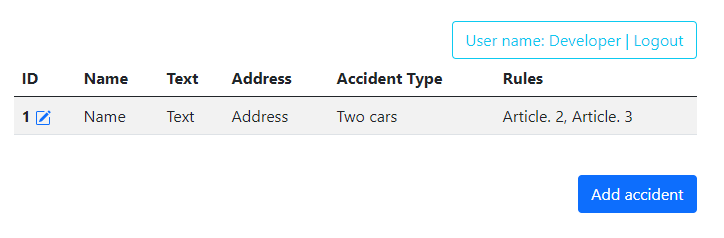
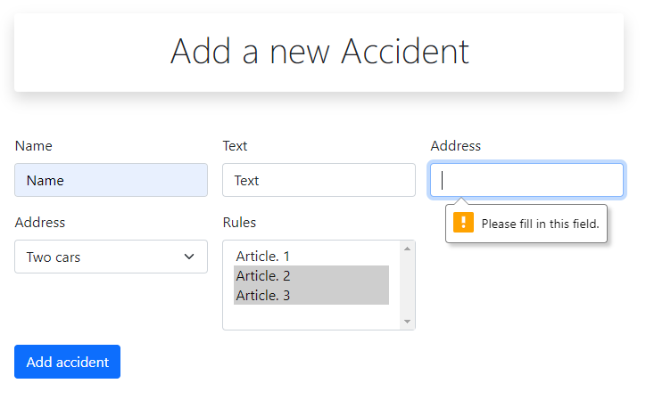
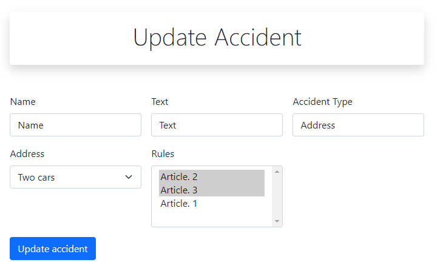
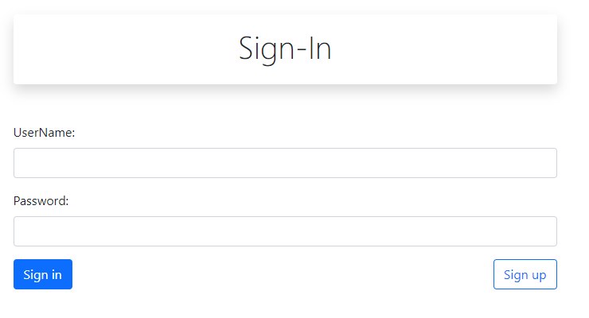
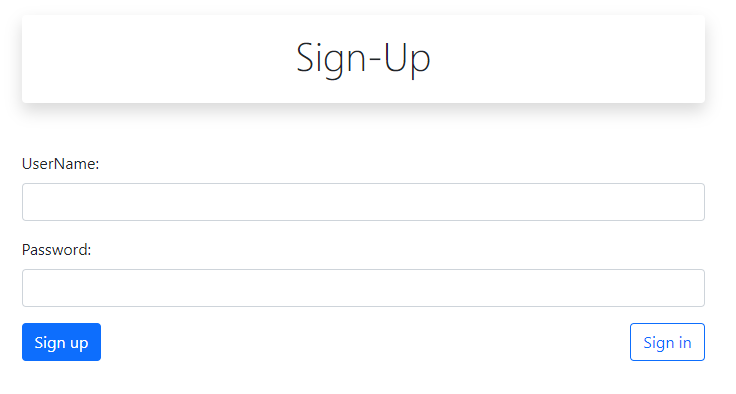

# job4j_car_accident

Техническое задание - проект "Автонарушители" с использованием с Spring

Краткое описание проекта:
- Система регистрации и авторизации пользователей с использованием Spring Security
- Фильтр для ограничения доступа не зарегистрированных пользователей к страницам сайта
- Данные хранятся в базе данных PostgreSQL
- Работа с базой данных осуществлялась разными вариантами с помощью: Spring JDBC, Hibernate, Spring Data

   
   

В данном проекте использовались:
- Java 11
- Servlet
- JSP, JSTL, Bootstrap
- Spring WebMVC
- Spring Security
- PostgreSQL, Hibernate, Spring Data, Spring JDBC, Spring ORM
- JaCoCo, Checkstyle
- SLF4J, Logback
- Apache Commons DBCP
   
   
  
    
  
    
  
    
  
    
  